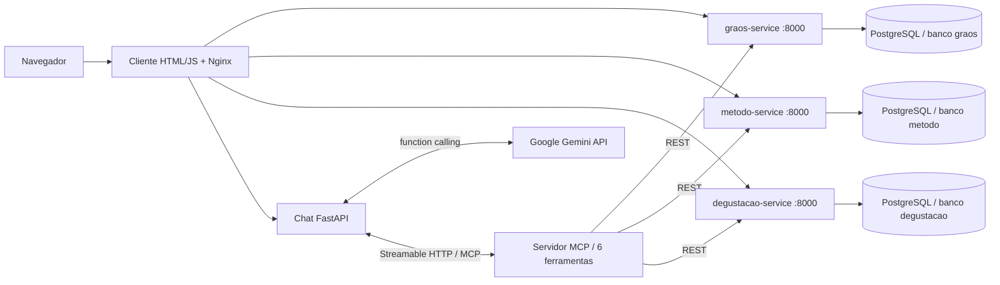

# Cafeteria Sensorial

Projeto individual de **Desenvolvimento de Aplicações Orientadas a Serviços**, pós-graduação IFBA — Campus Vitória da Conquista. Professor Luis Paulo da Silva Carvalho. Entrega prevista no enunciado: **20/09/2026**.

Catálogo de cafés especiais, métodos de preparo e registros de degustação. Três APIs REST em Python/FastAPI, PostgreSQL, cliente web resiliente, servidor MCP oficial e chat com Gemini.

## Iniciar

Requisitos: Docker Engine/Docker Desktop com Docker Compose v2 ou superior. No Windows, execute os comandos em WSL ou adapte `cp` para `Copy-Item` no PowerShell. Nenhuma instalação local de Python é necessária para executar a aplicação.

```bash
cp .env.example .env
docker compose up -d --build
docker compose ps
```

Abra **[http://localhost:8080](http://localhost:8080)**. As APIs são populadas automaticamente com **3 grãos, 5 métodos e 4 degustações fictícias** na primeira inicialização de cada banco. Reiniciar os contêineres preserva os dados.

| Componente | Endereço local | Documentação |
|---|---|---|
| Cliente web e chat | http://localhost:8080 | Interface principal |
| Grãos | http://localhost:8001/graos | http://localhost:8001/docs |
| Métodos | http://localhost:8002/metodos | http://localhost:8002/docs |
| Degustações | http://localhost:8003/degustacoes | http://localhost:8003/docs |
| MCP, Streamable HTTP | http://localhost:8004/mcp | Protocolo MCP, não é uma página web |
| API do chat | http://localhost:8005 | http://localhost:8005/docs |

As portas podem ser alteradas no `.env`. Os endereços internos usam os nomes dos serviços Docker; alterar portas externas não exige recompilar o frontend. O PostgreSQL não publica porta no host. As portas de demonstração ficam vinculadas a `127.0.0.1`.

## Habilitar o chat com IA

Edite `.env` e preencha `GEMINI_API_KEY` com uma chave da API Gemini. O modelo padrão é `gemini-2.5-flash`; `GEMINI_MODEL` permite selecionar outro modelo com function calling disponível na sua conta. Depois:

```bash
docker compose up -d --force-recreate chat
```

A chave fica apenas no backend. Não é enviada ao navegador nem incluída na imagem. O `.env` é ignorado pelo Git. Sem a chave, o restante do projeto funciona e o chat informa como configurá-la; não há resposta de IA simulada na aplicação.

Perguntas para a demonstração:

- “Quais grãos da Chapada Diamantina estão no catálogo?”
- “Quais métodos usam moagem grossa?”
- “Mostre os detalhes do grão 1, do método 1 e da degustação 1.”
- “Qual grão tem a melhor média de notas? Informe a quantidade de avaliações.”
- “Compare as notas declaradas do grão 1 com suas degustações.”

Com o seed original, o grão 1 tem média **9,3** em duas degustações; o grão 2, **8,8** em uma; o grão 3, **8,1** em uma. O chat recebe orientação para calcular médias, informar amostra e empates e distinguir notas declaradas de avaliações.

O chat usa a **Gemini API com function calling**: descobre as ferramentas usando `tools/list`, envia seus schemas ao modelo, recebe chamadas, executa `tools/call` pelo SDK MCP e devolve os resultados ao modelo. Não consulta as APIs REST diretamente. A interface exibe os nomes das ferramentas usadas. Cada turno abre uma nova conexão MCP e preserva até 12 mensagens anteriores no navegador; o backend limita o turno a 75 segundos e seis rodadas de chamadas.

## Arquitetura e estrutura



```text
graos-service/       # main.py, seed.json e Dockerfile próprios
metodo-service/      # main.py, seed.json e Dockerfile próprios
degustacao-service/  # main.py, seed.json e Dockerfile próprios
common/             # Infraestrutura de banco, saúde e erros; copiada nas imagens
postgres/init.sh    # Criação de três bancos e usuários separados
client/             # HTML, CSS, JS e proxy Nginx
mcp/                # Servidor oficial FastMCP; módulo de ferramentas por domínio
chat/               # API de chat e ponte MCP → Gemini → MCP
examples/           # Corpos JSON para POSTs via curl ou Swagger
tests/              # Testes de contrato REST, MCP e orquestração do chat
scripts/            # Verificação de MCP e teste real no navegador
docs/               # Roteiro de demonstração e registro de validação
docker-compose.yml  # Sete contêineres, rede e volume persistente
.env.example        # Configuração local de exemplo
```

Cada API cuida de um único domínio e possui imagem, processo, usuário de banco e banco próprios. O contêiner PostgreSQL é infraestrutura compartilhada. Cada banco guarda registros em uma tabela `registros`, com ID sequencial e conteúdo `JSONB` validado pelos modelos Pydantic na entrada e na resposta. As consultas usam parâmetros SQL e índice GIN para filtros. `common/` compartilha código de infraestrutura, não chamadas entre serviços.

As degustações guardam `grao_id` e `metodo_id` como referências simples, sem chave estrangeira entre bancos ou validação HTTP síncrona. Assim, continuam disponíveis quando catálogo ou métodos caem. Quando não conhece o nome, o cliente mostra o ID. O PostgreSQL compartilhado é um ponto comum de falha: se ele parar, as três APIs retornam indisponibilidade. A resiliência exigida é demonstrada parando uma API por vez.

## Rotas REST

| Serviço | Método | Rota | Filtros |
|---|---|---|---|
| Grãos | GET | `/graos` | `regiao`, `processo` |
| Grãos | GET | `/graos/{id}` | — |
| Grãos | POST | `/graos` | Corpo JSON |
| Métodos | GET | `/metodos` | `moagem` |
| Métodos | GET | `/metodos/{id}` | — |
| Métodos | POST | `/metodos` | Corpo JSON |
| Degustações | GET | `/degustacoes` | `grao_id` |
| Degustações | GET | `/degustacoes/{id}` | — |
| Degustações | GET | `/graos/{id}/degustacoes` | — |
| Degustações | POST | `/degustacoes` | Corpo JSON |
| Todas as APIs | GET | `/health` | Verifica também acesso ao banco |

POSTs retornam `201 Created` e cabeçalho `Location`; IDs inexistentes retornam `404`, dados inválidos `422` e indisponibilidade do banco `503`. Os filtros são exatos e respeitam acentos e maiúsculas. O campo `nota_final` usa escala **0–10**; `acidez`, `corpo` e `docura`, **1–5**. Preço é em reais por quilo; estoque é um número inteiro de sacas; temperatura é em °C, tempo em segundos e proporção café:água em massa. Datas incluem fuso horário; quando omitidas, usam o horário atual em UTC.

### Consultas e cadastros

```bash
curl http://localhost:8001/graos
curl http://localhost:8001/graos/1
curl -G http://localhost:8001/graos --data-urlencode 'regiao=Chapada Diamantina' --data-urlencode 'processo=natural'
curl -G http://localhost:8002/metodos --data-urlencode 'moagem=grossa'
curl http://localhost:8002/metodos/1
curl 'http://localhost:8003/degustacoes?grao_id=1'
curl http://localhost:8003/degustacoes/1
curl http://localhost:8003/graos/1/degustacoes

curl -i -X POST http://localhost:8001/graos -H 'Content-Type: application/json' --data-binary @examples/grao.json
curl -i -X POST http://localhost:8002/metodos -H 'Content-Type: application/json' --data-binary @examples/metodo.json
curl -i -X POST http://localhost:8003/degustacoes -H 'Content-Type: application/json' --data-binary @examples/degustacao.json
```

Também é possível cadastrar os dados pelo botão **Try it out** no Swagger de cada serviço.

### Executar um serviço isoladamente

Os comandos abaixo iniciam a API escolhida e seu requisito PostgreSQL, sem precisar das outras APIs, MCP ou chat:

```bash
docker compose up -d --build graos-service
docker compose up -d --build metodo-service
docker compose up -d --build degustacao-service
```

Execute apenas o comando do serviço desejado em uma instalação ainda parada. Para ver logs: `docker compose logs -f graos-service`.

## Demonstrar resiliência

Com a aplicação completa em execução, mantenha a página aberta e execute:

```bash
docker compose stop graos-service
# Aguarde até cerca de 8 segundos e observe os três painéis.
docker compose start graos-service
# Aguarde o serviço iniciar e a próxima consulta automática.
```

O painel de grãos muda para **Indisponível**, preserva os dados anteriores com o horário da última consulta e tenta novamente automaticamente. Métodos e degustações continuam atualizando. Depois do `start`, o painel volta a **Disponível** sem recarregar a página. Repita com `metodo-service` ou `degustacao-service`.

O JavaScript mantém um ciclo independente por API: faz uma consulta com timeout de **2,5 segundos**, trata a falha e agenda nova tentativa **5 segundos após a conclusão**. Não há um `Promise.all` que torne um serviço dependente dos outros nem chamadas bloqueantes na UI. O Nginx resolve novamente os nomes Docker, permitindo inclusive recriar um contêiner com outro IP. Se um filtro mudar durante uma queda, dados de outro filtro não são apresentados como resultado dele.

As ferramentas MCP também têm timeout de **2 segundos por consulta REST** e retornam erros por ferramenta. Assim, o chat pode informar a ausência de um domínio e continuar consultando os demais. Para demonstrar, pare grãos e pergunte sobre métodos de moagem grossa.

## Ferramentas MCP

| Domínio | Ferramenta dedicada | Endpoint REST acessado |
|---|---|---|
| Grãos | `graos_listar` | `GET /graos` |
| Grãos | `graos_obter` | `GET /graos/{id}` |
| Métodos | `metodos_listar` | `GET /metodos` |
| Métodos | `metodos_obter` | `GET /metodos/{id}` |
| Degustações | `degustacoes_listar` | `GET /degustacoes` |
| Degustações | `degustacoes_obter` | `GET /degustacoes/{id}` |

Há um servidor MCP com três módulos de domínio e **duas ferramentas por serviço**. O transporte é Streamable HTTP, modo stateless, em `/mcp`. Não é uma API HTTP imitando MCP: usa `FastMCP` e `ClientSession` do SDK oficial. A dependência é fixada em `mcp==1.30.0`, mantendo a linha 1.x para reprodutibilidade.

Para inspecionar ferramentas através do chat, sem chave Gemini:

```bash
curl http://localhost:8005/tools
```

Para chamar todas as seis ferramentas usando diretamente o SDK MCP:

```bash
python3 -m venv .venv
.venv/bin/python -m pip install -r requirements-dev.txt
.venv/bin/python scripts/check_mcp.py
```

## Testes

```bash
# Testes de orquestração com modelo simulado (não geram chamadas pagas):
.venv/bin/python -m pytest -q

# Integração com PostgreSQL, REST e MCP reais; Compose deve estar ativo:
RUN_INTEGRATION=1 .venv/bin/python -m pytest -q

# Navegador: filtros, detalhes, layout móvel e erro de chave ausente:
.venv/bin/python -m playwright install chromium
.venv/bin/python scripts/check_browser.py

# Também para e reinicia cada uma das três APIs, restaurando-as ao terminar:
.venv/bin/python scripts/check_browser.py --resilience
```

Os testes de POST removem **apenas os IDs que eles próprios criaram**, usando o banco da respectiva API. Não apagam seeds nem cadastros preexistentes. O teste visual pressupõe o seed original (três grãos); execute antes de adicionar cadastros para manter a contagem esperada. Capturas ficam em `artifacts/` e não são versionadas. Para portas alternativas, exporte `GRAOS_PORT`, `METODO_PORT`, `DEGUSTACAO_PORT`, `MCP_TEST_URL` e `CLIENT_TEST_URL` ao executar os testes.

Os testes com modelo simulado validam a ponte de ferramentas, não comprovam acesso real à conta Gemini. Para isso, configure sua chave e execute uma pergunta no chat. Veja [docs/VALIDACAO.md](docs/VALIDACAO.md).

## Operação e persistência

```bash
docker compose ps
docker compose logs --tail=100 chat mcp
docker compose stop          # Pausa os contêineres, preserva dados
docker compose start         # Retoma os contêineres existentes
docker compose down          # Remove contêineres/rede, preserva o volume
docker compose up -d          # Recria usando o volume existente
```

**Reinicialização destrutiva, somente se quiser apagar todos os cadastros:** `docker compose down -v`, seguido de `docker compose up -d`. O script de criação de bancos roda apenas quando o volume é novo. Alterar senhas no `.env` não altera usuários de um volume existente; atualize os usuários no PostgreSQL ou reinicialize conscientemente o volume de demonstração.

Os healthchecks do MCP e do chat indicam que seus processos estão disponíveis; não comprovam conexão com todas as APIs nem validade da chave. `/tools` testa a conexão chat → MCP. A disponibilidade dos domínios é avaliada a cada consulta.

## Entrega e referências

O [roteiro de vídeo](docs/ROTEIRO-VIDEO.md) organiza uma demonstração de até sete minutos. As obrigações acadêmicas de aprovação do tema e envio do material são descritas no PDF do professor; este projeto não envia e-mails nem publica entregas automaticamente.

- [SDK Python oficial do MCP, linha 1.x](https://github.com/modelcontextprotocol/python-sdk/tree/v1.x).
- [Gemini: function calling na Gemini API](https://ai.google.dev/gemini-api/docs/function-calling).

Escopo: demonstração acadêmica local, sem autenticação de usuários ou publicação na internet. As credenciais PostgreSQL de exemplo são para esse ambiente local.
